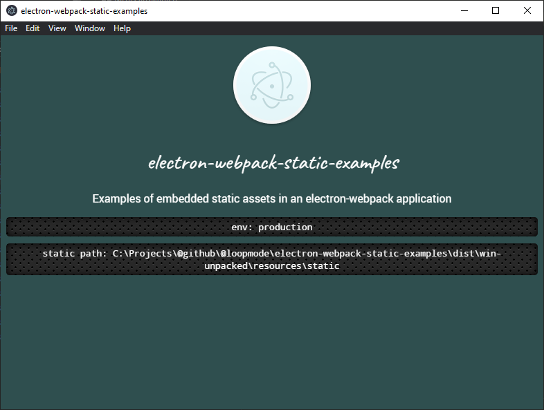

# electron-webpack-static-examples

Examples of how to include static files in [electron-webpack](https://github.com/electron-userland/electron-webpack).

These examples cover some details that are not explained (yet) in [the docs](https://webpack.electron.build/using-static-assets), like the need to distinguish between development and production environment, or how to get the paths working in bundled vs static css/scss stylesheets.

**In local development server:**  
 

**Production build, running the unpacked `/dist` application:**  
 

**Production build, running the installed application:**  
 

## `getStatic` utility

You'll always need a utility function that returns a URL during development, but a file path in production. Check [`src/renderer/utils/getStatic.ts`](./src/renderer/utils/getStatic.ts) for that.

If you use TypeScript, make sure to declare the magic `__static` global provided by electron-webpack. Check [`src/globals.d.ts`](./src/globals.d.ts) for that.

When referring to static assets from within bundled code, use the helper function to retrieve the asset path.

```javascript
document.write(``);

const theme = document.createElement("link");
theme.setAttribute("rel", "stylesheet");
theme.setAttribute("type", "text/css");
theme.setAttribute("href", getStatic("theme.css"));
document.head.appendChild(theme);
```

## Static stylesheet

If you do import a stylesheet from the static folder, that stylesheet may include additional static files using regular relative paths, without any extra tricks.

Have a look at the example of including multiple font files:

- https://github.com/loopmode/electron-webpack-static-examples/blob/static-font-extra-stylesheet/src/renderer/index.ts
- https://github.com/loopmode/electron-webpack-static-examples/blob/static-font-extra-stylesheet/static/theme.css

The index file uses the `getStatic` helper to reference the static stylesheet `static/theme.css`.
Inside `static/theme.css` we import the file `static/fonts/roboto-fontfacekit/stylesheet.css`, but we can use regular relative paths from here on:

```css
/* we're already inside a file loaded from the static folder, so we can use relative paths as usual */
@import "./fonts/roboto-fontfacekit/stylesheet.css";
```

And inside the font's `stylesheet.css`, we can keep using relative paths and reference each font file:

```css
@font-face {
  font-family: Roboto;
  src: url("./Roboto-Black-webfont.woff") format("woff");
  font-weight: 900;
  font-style: normal;
  font-stretch: normal;
}
```

The same goes for background images or any other asset you can include from inside a static stylesheet.

## Bundled stylesheets

If you need to access static resources fron non-static stylesheets, that is from any stylesheets bundled via webpack (css/scss/less etc), you'll need to provide additional configuration to make it work.

The trick is to provide a webpack alias that points to the static folder, then use that alias inside the stylesheets to reference your files.

Have a look at this commit: https://github.com/loopmode/electron-webpack-static-examples/commit/131c5e4d18fa9985dab762dd8624a847babf5f98

It adds

- webpack alias configuration
  ```
  resolve: {
      alias: {
        // for accessing static folder from inside stylesheets
        static: path.resolve(__dirname, "static"),
      },
    }
  ```
- stylesheet that is bundled via webpack
  - reference to static font via `~static` alias  
    `@font-face { /* ... */ src: url("~static/fonts/NotoMono-Regular-webfont.woff") format("woff"); /* ... */ `
  - reference to static background image via `~static` alias  
    `background: url("~static/carbon_fibre.png")`

# electron-webpack-quick-start

> A bare minimum project structure to get started developing with [`electron-webpack`](https://github.com/electron-userland/electron-webpack).

Thanks to the power of `electron-webpack` this template comes packed with...

- Use of [`webpack-dev-server`](https://github.com/webpack/webpack-dev-server) for development
- HMR for both `renderer` and `main` processes
- Use of [`babel-preset-env`](https://github.com/babel/babel-preset-env) that is automatically configured based on your `electron` version
- Use of [`electron-builder`](https://github.com/electron-userland/electron-builder) to package and build a distributable electron application

Make sure to check out [`electron-webpack`'s documentation](https://webpack.electron.build/) for more details.

## Getting Started

Simply clone down this repository, install dependencies, and get started on your application.

The use of the [yarn](https://yarnpkg.com/) package manager is **strongly** recommended, as opposed to using `npm`.

```bash
# create a directory of your choice, and copy template using curl
mkdir new-electron-webpack-project && cd new-electron-webpack-project
curl -fsSL https://github.com/electron-userland/electron-webpack-quick-start/archive/master.tar.gz | tar -xz --strip-components 1

# or copy template using git clone
git clone https://github.com/electron-userland/electron-webpack-quick-start.git
cd electron-webpack-quick-start
rm -rf .git

# install dependencies
yarn
```

### Development Scripts

```bash
# run application in development mode
yarn dev

# compile source code and create webpack output
yarn compile

# `yarn compile` & create build with electron-builder
yarn dist

# `yarn compile` & create unpacked build with electron-builder
yarn dist:dir
```
